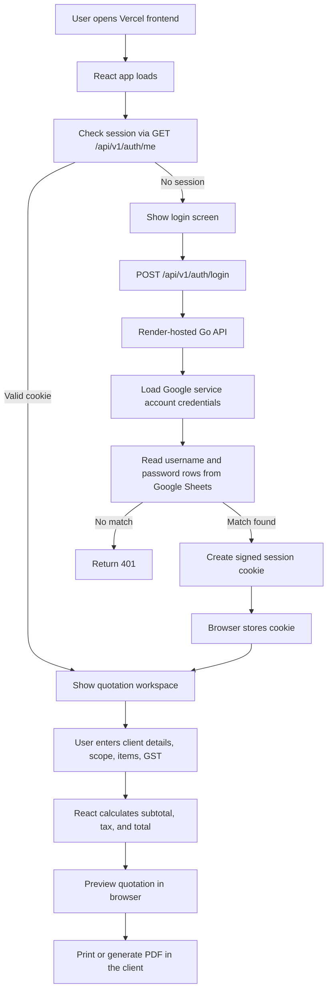

# Quotify

Quotify is a lightweight quotation workspace for Door2Door Interiors. The app lets team members sign in with credentials stored in Google Sheets, prepare itemized interior quotations, preview them in the browser, and export them as printable PDFs.

The repository contains:

- `my-app/`: React frontend, hosted on Vercel
- `backend-go/`: Go API using Gin, hosted on Render
- `render.yaml`: Render service definition for the backend

## Product Flow



## Architecture

### Frontend

- Built with React 19 and Create React App tooling.
- Uses a simple client-side router based on `window.history`.
- Calls the backend with `credentials: 'include'` so the session cookie is sent on each auth request.
- Generates the quotation preview and downloadable PDF entirely in the browser.
- Chooses the API base URL from the browser hostname or `REACT_APP_ENV`.

Key files:

- [my-app/src/App.js](/C:/Users/Imart/Desktop/POC/Quotify/my-app/src/App.js)
- [my-app/src/config/api.js](/C:/Users/Imart/Desktop/POC/Quotify/my-app/src/config/api.js)
- [my-app/src/App.css](/C:/Users/Imart/Desktop/POC/Quotify/my-app/src/App.css)

### Backend

- Built with Go 1.22 and Gin.
- Exposes auth endpoints and a ping endpoint.
- Verifies credentials against the first two columns of a Google Sheet.
- Issues an HMAC-signed session cookie after successful login.
- Allows cross-origin requests from approved frontend domains.

Key files:

- [backend-go/cmd/server/main.go](/C:/Users/Imart/Desktop/POC/Quotify/backend-go/cmd/server/main.go)
- [backend-go/internal/routes/routes.go](/C:/Users/Imart/Desktop/POC/Quotify/backend-go/internal/routes/routes.go)
- [backend-go/internal/handlers/auth.go](/C:/Users/Imart/Desktop/POC/Quotify/backend-go/internal/handlers/auth.go)
- [backend-go/internal/sheets/credentials.go](/C:/Users/Imart/Desktop/POC/Quotify/backend-go/internal/sheets/credentials.go)

## Repository Layout

```text
.
|-- backend-go/
|   |-- cmd/server/main.go
|   |-- internal/handlers/
|   |-- internal/routes/
|   |-- internal/sheets/
|   |-- .env.example
|   `-- README.md
|-- my-app/
|   |-- public/
|   |-- src/
|   |-- .env.example
|   `-- README.md
|-- render.yaml
|-- AGENTS.md
`-- README.md
```

## API Endpoints

| Method | Path | Purpose |
| --- | --- | --- |
| `GET` | `/api/v1/ping` | Basic uptime check |
| `GET` | `/api/v1/auth/health` | Verifies auth configuration is usable |
| `POST` | `/api/v1/auth/login` | Validates credentials and creates a session |
| `GET` | `/api/v1/auth/me` | Returns current authenticated user if cookie is valid |
| `POST` | `/api/v1/auth/logout` | Clears the session cookie |

## Local Development

### Prerequisites

- Node.js and npm
- Go 1.22+
- A Google Cloud service account with Sheets read access
- A Google Sheet containing login credentials in the first two columns of the selected range

### 1. Backend setup

From [backend-go/.env.example](/C:/Users/Imart/Desktop/POC/Quotify/backend-go/.env.example), create `backend-go/.env` and fill in:

```env
GOOGLE_SHEET_ID=your-google-spreadsheet-id
GOOGLE_SHEET_RANGE=login!A:B
GOOGLE_SERVICE_ACCOUNT_FILE=./service-account.json
AUTH_SESSION_SECRET=replace-with-a-long-random-secret
COOKIE_SECURE=false
CORS_ALLOWED_ORIGINS=http://localhost:3000
AUTH_DEBUG=false
```

Then place the service account JSON at `backend-go/service-account.json`, or use `GOOGLE_SERVICE_ACCOUNT_JSON` instead.

Run the backend:

```bash
cd backend-go
go run ./cmd/server
```

The API starts on `http://localhost:8000` unless `PORT` is set.

### 2. Frontend setup

From [my-app/.env.example](/C:/Users/Imart/Desktop/POC/Quotify/my-app/.env.example), create `my-app/.env`:

```env
REACT_APP_ENV=local
```

Run the frontend:

```bash
cd my-app
npm install
npm start
```

The app runs on `http://localhost:3000`.

### 3. Google Sheets format

The backend expects the configured range to contain:

| Column A | Column B |
| --- | --- |
| username | password |

Notes:

- The sheet/tab name is part of `GOOGLE_SHEET_RANGE`, not `GOOGLE_SHEET_ID`.
- The service account `client_email` must be shared on the spreadsheet with at least Viewer access.
- Credentials are currently matched against sheet values directly.

## Deployment

### Frontend on Vercel

The frontend is intended to be deployed from `my-app/`.

Current production hostname mapping in the code:

- `quotify-net.vercel.app` -> production backend
- `dev-quotify.intermesh.net` -> development backend
- `quotify.intermesh.net` -> production backend

The frontend API resolver lives in [my-app/src/config/api.js](/C:/Users/Imart/Desktop/POC/Quotify/my-app/src/config/api.js).

### Backend on Render

[render.yaml](/C:/Users/Imart/Desktop/POC/Quotify/render.yaml) defines a single Go web service:

- Service name: `quotify-i62o`
- Root directory: `backend-go`
- Build command: `go build -tags netgo -ldflags '-s -w' -o app ./cmd/server`
- Start command: `./app`
- Health check: `/api/v1/auth/health`

Important Render environment variables:

- `GOOGLE_SHEET_ID`
- `GOOGLE_SHEET_RANGE`
- `GOOGLE_SERVICE_ACCOUNT_JSON`
- `AUTH_SESSION_SECRET`
- `COOKIE_SECURE=true`
- `CORS_ALLOWED_ORIGINS=https://quotify-net.vercel.app`
- `AUTH_DEBUG=false`

## Authentication Notes

- Sessions are stored in an HTTP-only cookie named `quotify_session`.
- Session tokens are signed with `AUTH_SESSION_SECRET`.
- Cookie lifetime is 12 hours.
- `COOKIE_SECURE` should be `true` in HTTPS environments such as Render behind a public domain.
- The frontend depends on cross-origin cookies, so CORS and browser credentials mode must stay aligned.

## Quotation Behavior

- Quotation data is not persisted in the backend or a database.
- All quotation editing state lives in the React app.
- Totals are calculated in the browser from line items and GST settings.
- Preview rendering, print rendering, and direct PDF generation all happen client-side.

## Testing

Frontend:

```bash
cd my-app
npm test
```

Backend:

```bash
cd backend-go
go test ./...
```

## Known Constraints

- Authentication depends on Google Sheets availability.
- Credentials in the sheet are compared as plain text.
- There is no database or server-side quotation history.
- The app currently focuses on authentication and quotation generation only.

## Suggested Next Improvements

- Move sheet-based credentials to a stronger auth system when ready.
- Persist quotations for reuse, search, and audit history.
- Add backend tests for auth and Sheets integration boundaries.
- Add Vercel project configuration docs if the deployment is managed outside this repository.
